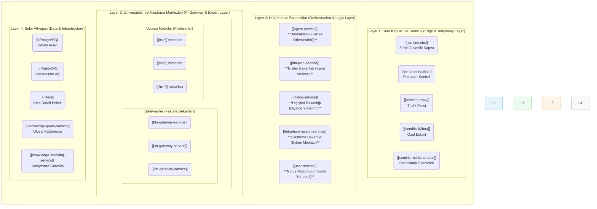

### **Sentiric: Bir İletişim İşletim Sisteminin Doğuşu**

**Okuyucu Rehberi:** Bu belge, Sentiric platformunu sıfırdan tanımak isteyen herkes için tasarlanmıştır. İster bir şirket yöneticisi, ister bir geliştirici, ister sadece teknoloji meraklısı olun, bu rehber size Sentiric'in **"Ne Olduğunu"**, **"Nasıl Çalıştığını"** ve **"Neden Önemli Olduğunu"** anlatacaktır.

---

### **Bölüm 1: Vizyon - Telefon Neden Yeniden İcat Edilmeli?**

#### **1.1 Sorun: "Dijital Dünyanın Aptal Telefonu"**

Bugün, cebimizdeki telefonlar birer süper bilgisayar. Ancak şirketlerimizi aradığımızda karşılaştığımız deneyim hala 1990'lardan kalma. "Satış için 1'e, destek için 2'ye basın" diyen robotik sesler, bitmek bilmeyen bekleme müzikleri ve derdimizi defalarca farklı kişilere anlatma zorunluluğu...

İletişim, dijital dönüşümün en geride kalmış halkasıdır. Müşterilerinizle aranızdaki en önemli köprü olan telefon hattınız, genellikle en verimsiz, en maliyetli ve en sinir bozucu kanalınızdır.

#### **1.2 Sentiric'in Cevabı: "İletişim İşletim Sistemi"**

Sentiric, bu sorunu çözmek için doğdu. Biz, basit bir "sesli bot" veya "çağrı merkezi yazılımı" değiliz. Biz, **yeni nesil bir "İletişim İşletim Sistemi" (Communication OS)** inşa ediyoruz.

Peki bu ne anlama geliyor?

Tıpkı Windows veya MacOS'un bilgisayarınızın donanımını yönetip üzerine binlerce farklı uygulama kurmanıza olanak tanıması gibi, **Sentiric de şirketinizin tüm iletişim kanallarını (telefon, WhatsApp, web sitesi sohbeti) yönetir ve üzerine sonsuz sayıda akıllı iş süreci (uygulama) inşa etmenizi sağlar.**

**Özetle:** Sentiric, şirketinizin iletişimini bir gider kaleminden, rakiplerinize karşı üstünlük kurmanızı sağlayan akıllı bir varlığa dönüştürür.

#### **1.3 Bizi Farklı Kılan İki Temel Felsefe**

Piyasada birçok iletişim çözümü var. Peki Sentiric'in farkı ne? İki basit ama güçlü felsefe:

1.  **"Tak-Çıkar Lego Seti":** Platformumuz, belirli bir teknolojiye (örneğin Google'ın yapay zekasına veya Amazon'un altyapısına) bağımlı değildir. Her bir parça, bir Lego tuğlası gibi değiştirilebilir. Bugün Google'ın en iyi yapay zekasını kullanırken, yarın daha uygun maliyetli veya daha güvenli yerel bir modeli tek bir ayarla değiştirebilirsiniz. **Teknolojiye değil, size hizmet ederiz.**

2.  **"Dijital Egemenlik":** Rakiplerimiz size "kiralık" bir çözüm sunarken, biz size iletişim geleceğinizin **"tapusunu"** veriyoruz. Sentiric, isterseniz bizim bulut sunucularımızda (kolaylık için), isterseniz tamamen sizin kendi sunucularınızda (maksimum güvenlik ve kontrol için) çalışabilir. Müşteri verileriniz, asla sizin izniniz olmadan sunucularınızın dışına çıkmaz. **Kontrol tamamen sizdedir.**

---
Harika. Vizyonumuzu ve felsefemizi anladıktan sonra, şimdi kaputu açıp bu "İletişim İşletim Sistemi"nin içinde neler olduğuna, hangi parçaların bir araya gelerek bu akıllı yapıyı oluşturduğuna bakalım.

---

### **Bölüm 2: Sentiric Nasıl Çalışır? - Bir Dijital Varlığın Anatomisi**

Sentiric, tek bir devasa program değil, her biri kendi alanında uzmanlaşmış, birbiriyle sürekli konuşan küçük ve akıllı servislerden oluşan bir **dijital organizmadır.** Bu yapı, ona hem dayanıklılık hem de esneklik kazandırır.

Bu organizmayı, bir şehir gibi düşünebiliriz. Her bir katman, şehrin farklı bir fonksiyonunu yerine getirir.

#### **2.1 Şehrin Katmanları: Mimarimize Kuşbakışı**

#### **2.2 Bir Telefon Çağrısının Anatomisi: Şehirdeki Yolculuk**

Bir müşteri, şirketinizin numarasını aradığında aslında bu şehirde inanılmaz hızlı bir yolculuğa çıkar. Gelin bu yolculuğu adım adım takip edelim:

**Adım 1: Sınır Kapısından Giriş (`sbc` & `proxy`)**

*   Arama, önce şehrin zırhlı duvarları olan **`sbc` (Güvenlik Kapısı)**'na çarpar. `sbc`, bu aramanın güvenli olup olmadığını kontrol eder, "pasaportunu" (teknik bilgilerini) temizler ve içeriye alır.
*   Ardından **`proxy` (Trafik Polisi)** devreye girer. Gelen bu "turistin" (çağrının) nereye gitmesi gerektiğini anlamak için **İçişleri Bakanlığı**'na (`dialplan-service`) danışır.

**Adım 2: Stratejik Karar (`dialplan-service` & `user-service`)**

*   **`dialplan-service` (İçişleri Bakanlığı)**, bu kararı vermek için iki yere bakar:
    1.  **Devlet Arşivi (`PostgreSQL`):** "Bu telefon numarası (`90212...`) için hangi kural geçerli?" diye sorar.
    2.  **Nüfus Müdürlüğü (`user-service`):** "Bu vatandaş (`90555...`) kimdir, kayıtlarımızda var mı?" diye sorar.
*   Bu bilgilere göre nihai kararını verir: "Bu çağrı, bilinen bir müşteri. **Başbakanlık**'a (`agent-service`) `START_AI_CONVERSATION` (Yapay Zeka Diyaloğu Başlat) emrini verin."

**Adım 3: Eyleme Geçiş (`agent-service` ve Bakanlıklar)**

*   **`agent-service` (Başbakanlık)**, İçişleri'nden gelen bu emri alır. Artık görevi, bu emri hayata geçirmektir. Ama bu işi tek başına yapmaz, uzman bakanlıkları göreve çağırır:
    *   **Dışişleri Bakanlığı'na (`dialog-service`) döner:** "Bu bilinen müşteri için bir karşılama diyaloğu başlat."
    *   **Ulaştırma Bakanlığı'na (`telephony-action-service`) döner:** "Dışişleri'nin hazırladığı karşılama mesajını vatandaşa dinlet."

**Adım 4: Diyalog ve Zeka Döngüsü (Bakanlıklar ve Üniversiteler)**

Müşteri konuşmaya başladığında, asıl sihir burada gerçekleşir:

1.  **Duyma:** **Ulaştırma Bakanlığı (`telephony-action-service`)**, müşterinin sesini duyar ve bunu **STT Fakültesi Dekanı'na (`stt-gateway`)** gönderir. Dekan, bu sesi en iyi anlayacak **Profesör'ü (`stt-whisper-service`)** görevlendirir ve ses metne çevrilir.
2.  **Anlama:** Metin, **Dışişleri Bakanlığı'na (`dialog-service`)** geri döner. Bakanlık, metni anlamlandırmak için **Ulusal Kütüphane'ye (`knowledge-query-service`)** danışır ("Bu konuyla ilgili arşivlerimizde ne var?").
3.  **Düşünme:** Bakanlık, hem müşterinin söylediği metni hem de kütüphaneden gelen bilgileri birleştirip, bir "brifing dosyası" (prompt) hazırlayarak **LLM Fakültesi Dekanı'na (`llm-gateway`)** gönderir. Dekan, bu brifingi en iyi yorumlayacak **Profesör'ü (`llm-gemini-service`)** seçer ve bir cevap metni üretilir.
4.  **Konuşma:** Üretilen cevap, Dışişleri Bakanlığı üzerinden **Ulaştırma Bakanlığı'na** iletilir. Ulaştırma Bakanlığı, bu metni **TTS Fakültesi Dekanı'na (`tts-gateway`)** gönderir. Dekan, en uygun sese sahip **Profesör'ü (`tts-edge-service`)** görevlendirir ve metin, doğal bir insan sesine dönüştürülür.
5.  **İletme:** Son olarak, Ulaştırma Bakanlığı, bu sesi müşterinin kulağına iletir.

Tüm bu karmaşık yolculuk, göz açıp kapayıncaya kadar, saniyenin altında bir sürede tamamlanır. Müşteri için ise sadece karşısında akıcı ve akıllı biriyle konuştuğu hissiyatı kalır.

---

### **Bölüm 3: Sentiric'in Gücü - Sadece Bir Telefon Değil, Bir Platform**

Sentiric'in asıl değeri, tek tek yaptığı işlerde değil, bu işleri bir araya getirme biçiminde ve bu yapının sunduğu **sonsuz olasılıklarda** yatar.

#### **3.1 Yönetim Paneli (`dashboard-ui`): Şehrin Kontrol Kulesi**

Tüm bu karmaşık şehir, kod yazmayı bilmeyen bir "belediye başkanı" (şirket yöneticisi) tarafından bile kolayca yönetilebilir. Yönetim paneli, size şehrin anahtarını verir:

*   **Vatandaşları (Kullanıcıları) Yönetin:** Tek bir tıklamayla yeni bir müşteri ekleyin veya bir çalışanın telefon numarasını güncelleyin.
*   **Trafik Kurallarını (Dialplan) Değiştirin:** Mesai saatleri dışında gelen aramaların artık sesli mesaja değil, doğrudan genel müdürün cep telefonuna yönlendirilmesini mi istiyorsunuz? Bunu, bir form doldurur gibi saniyeler içinde yapabilirsiniz. Kod değişikliği yok, anında canlıda.
*   **Şehir Tutanaklarını (CDR) Okuyun:** Dün gece gelen tüm aramaları, kimin aradığını, ne kadar sürdüğünü ve ne konuşulduğunu tek bir ekrandan görün.

**Gücü:** Platformun tüm davranışını, mühendislere ihtiyaç duymadan, işin sahibi olan sizlerin yönetmesini sağlar.

#### **3.2 Hibrit Çalışma Masası (`web-agent-ui`): İnsan ve Yapay Zekanın Buluştuğu Yer**

Sentiric, insanları denklemden çıkarmayı değil, onları **süper güçlerle donatmayı** hedefler. Yapay zeka, bir müşterinin talebini anlayamadığında veya müşteri sinirlendiğinde, çağrıyı sonlandırmaz. Bunun yerine, bir "imdat" sinyali gönderir.

Bu sinyal, insan temsilcinizin önündeki **`web-agent-ui` (Hibrit Çalışma Masası)** ekranına düşer. Temsilciniz, sadece "yeni bir arama var" uyarısı almaz; o ana kadar yapay zeka ile müşteri arasında geçen **tüm konuşmanın dökümünü ve müşterinin tüm geçmişini** tek bir ekranda görür.

Tek bir tıklamayla konuşmaya dahil olduğunda, müşteriye "Merhaba, derdinizi en baştan anlatır mısınız?" diye sormaz. Bunun yerine, "Merhaba Ahmet Bey, anlıyorum ki VIP Check-up paketinizle ilgili bir sorun yaşıyorsunuz. Hemen yardımcı oluyorum." der.

**Gücü:** Müşteri memnuniyetini zirveye çıkarır ve insan temsilcilerinizi, tekrarlayan işler yapan "operatörlerden", karmaşık sorunlar çözen "uzmanlara" dönüştürür.

#### **3.3 Dış Dünya ile Konuşan Eller (`connectors-service`): Sadece Konuşmaz, İş Yapar**

Sentiric'in en büyük güçlerinden biri, sadece dinleyip cevap vermekle kalmaması, aynı zamanda **eyleme geçmesidir.**

Bir müşteri, "Yarın öğleden sonraya bir randevu almak istiyorum" dediğinde, Sentiric "Tamamdır" demekle yetinmez. Arka planda, **`connectors-service` (Dış Dünya Bakanlığı)** aracılığıyla, şirketinizin **Google Calendar**'ına bağlanır, boş bir zaman dilimi bulur ve randevuyu **gerçekten oluşturur.** Müşteri telefonu kapattığında, randevusu takviminizde hazırdır.

Aynı şekilde, bir sipariş durumunu soran müşteriye cevap vermek için envanter sisteminize (ERP) bağlanabilir veya bir ödeme almak için Stripe gibi ödeme sistemlerini tetikleyebilir.

**Gücü:** Sentiric'i, bilgi veren bir asistandan, uçtan uca iş akışlarınızı otomatize eden bir "dijital çalışana" dönüştürür.

#### **3.4 Uygulama Mağazası (`marketplace-service`): Büyüyen Bir Ekosistem**

Sentiric'in nihai vizyonu, sadece bizim tarafımızdan geliştirilen bir platform olmak değildir. Tıpkı Apple'ın App Store'u veya Google'ın Play Store'u gibi, Sentiric'in de bir **"Uygulama Mağazası"** vardır.

Bu mağazada, farklı endüstriler için önceden hazırlanmış, tek tıkla kurulabilen "uygulama paketleri" bulunur. Biz bunlara **"Reçete" (Recipe)** diyoruz.

*   Bir restoran sahibi misiniz? `dashboard-ui`'den "Restoran Rezervasyon Reçetesi"ni tek tıkla kurarsınız. Platform, anında restoranınızın menüsünü öğrenir, rezervasyon kurallarınızı uygular ve 7/24 telefonla rezervasyon almaya başlar.
*   Bir hastane yöneticisi misiniz? "Hastane Randevu Reçetesi"ni kurarsınız. Platform, hasta bilgilerinin gizliliğine (KVKK/HIPAA) uygun şekilde çalışmaya ve farklı departmanlar için randevu vermeye başlar.

Dahası, bu mağazaya sadece biz değil, **dışarıdan geliştiriciler de** kendi "Reçetelerini" ekleyip satabilirler. Bu, platformun bizim hayal bile edemeyeceğimiz alanlarda, inanılmaz bir hızla büyümesini sağlar.

**Gücü:** Sentiric'i kapalı bir üründen, etrafında bir topluluk ve ekonomi oluşturan, yaşayan, nefes alan bir **ekosisteme** dönüştürür.

---

### **Bölüm 4: Gelecek Vizyonu - Sadece Başlangıç**

Bugün Sentiric, ses ve metin tabanlı iletişimi otomatize eden son derece güçlü bir platform. Ancak bu, potansiyelinin sadece bir başlangıcıdır. "İletişim İşletim Sistemi" felsefemiz, bize gelecekte de teknoloji eğrilerinin önünde kalma esnekliği sunuyor.

#### **4.1 Akıllı Kaynak Yönetimi: Kendi Kendini Optimize Eden Beyin**

Platformumuzdaki "Fakülte Dekanları" (`tts-gateway`, `stt-gateway`, `llm-gateway`) şu anda bile istekleri doğru "Profesörlere" (uzman motorlar) yönlendiriyor. Gelecekte bu yapı çok daha akıllı hale gelecek:

*   **Maliyet-Performans Optimizasyonu:** Bir `tenant`, "Mümkün olan en düşük maliyetle çalışmak istiyorum" diye bir ayar yaptığında, Gateway'ler her istek için en ucuz (belki de en yavaş) AI motorunu seçecektir. Başka bir `tenant` "Hız benim için her şeyden önemli" dediğinde ise, Gateway'ler en hızlı (belki de en pahalı) motorları dinamik olarak tercih edecektir.
*   **Kendi Kendini İyileştirme:** `llm-gateway`, Gemini API'sinin yavaşladığını veya hata oranının arttığını fark ettiğinde, **otomatik olarak** trafiği OpenAI veya yerel bir modele kaydırabilir. Tıpkı bir şehrin, bir yolda kaza olduğunda trafiği alternatif yollara yönlendirmesi gibi. Platform, insan müdahalesi olmadan ayakta kalmayı öğrenir.

**Gelecek:** Sadece görevleri otomatize eden değil, kendi operasyonel verimliliğini ve maliyetini de anlık olarak otomatize eden bir platform.

#### **4.2 Geliştirici Ekosistemi: Birlikte Büyüyen Bir Ulus**

Bugün "Marketplace"in temellerini attık. Yarın bu, Sentiric'in en büyük büyüme motoru olacak:

*   **Geliştirici SDK'ları ve CLI:** Üçüncü parti geliştiricilere, kendi "Reçetelerini" veya "Connector'larını" kolayca oluşturup test edebilecekleri ve tek bir komutla (`sentiric recipe publish`) mağazamıza gönderebilecekleri araçlar sunacağız.
*   **Gelir Paylaşımı Modeli:** Geliştiriciler, Marketplace üzerinden sattıkları her "Reçete" için gelir elde edecekler. Bu, en yetenekli yazılımcıları ekosistemimize çekmek için güçlü bir teşvik olacaktır.

**Gelecek:** Sadece Sentiric ekibinin değil, dünya çapında binlerce geliştiricinin katkısıyla büyüyen, her gün yeni bir yetenek kazanan, yaşayan bir platform.

#### **4.3 Proaktif İletişim: Sorunları Ortaya Çıkmadan Çözmek**

Şu anda platformumuz, gelen isteklere **reaktif** olarak cevap veriyor. Gelecekte ise **proaktif** olarak harekete geçecek:

*   **Öngörüsel Müşteri Hizmetleri:** Sentiric, bir e-ticaret sitesinin lojistik sistemine bağlanır. Bir kargonun teslimatının hava koşulları nedeniyle 30 dakika gecikeceğini **tahmin eder.** Müşteri daha sinirlenip şirketi aramadan, Sentiric müşteriyi arar ve "Merhaba Ayşe Hanım, kargonuz yolda ancak hava durumu nedeniyle yaklaşık 30 dakikalık bir gecikme öngörüyoruz. Bu bir sorun teşkil eder mi, yoksa teslimatı yarına mı planlayalım?" diye sorar.
*   **Akıllı Sağlık Takibi:** Sentiric, bir hastanın akıllı saat verilerine bağlanır. Yalnız yaşayan yaşlı bir hastanın 24 saattir ilacını almadığını ve hareketliliğinin azaldığını fark eder. Otomatik olarak hastayı arar, cevap alamazsa yakınını veya acil servisi bilgilendirir.

**Gelecek:** Sadece sorunları çözen değil, sorunlar daha ortaya çıkmadan onları öngören ve çözen, müşterilerine ve kullanıcılarına "değer" sunan bir platform.

#### **4.4 Sonuç: Sizin İletişiminiz, Sizin Kurallarınız**

Sentiric'in yolculuğu, en başından beri tek bir nihai hedefe odaklanmıştır: **Size, iletişiminizin kontrolünü geri vermek.**

İster maliyetlerinizi %90 azaltmak isteyen bir CEO, ister müşterilerine 7/24 kesintisiz hizmet sunmak isteyen bir operasyon müdürü, isterse de üzerine hayalindeki iletişim uygulamasını inşa etmek isteyen bir geliştirici olun, Sentiric size bu gücü ve esnekliği sunar.

Bu, sadece bir teknoloji değil. Bu, iletişimin geleceğini şekillendirmek için bir davettir.

**Sentiric'e hoş geldiniz.**